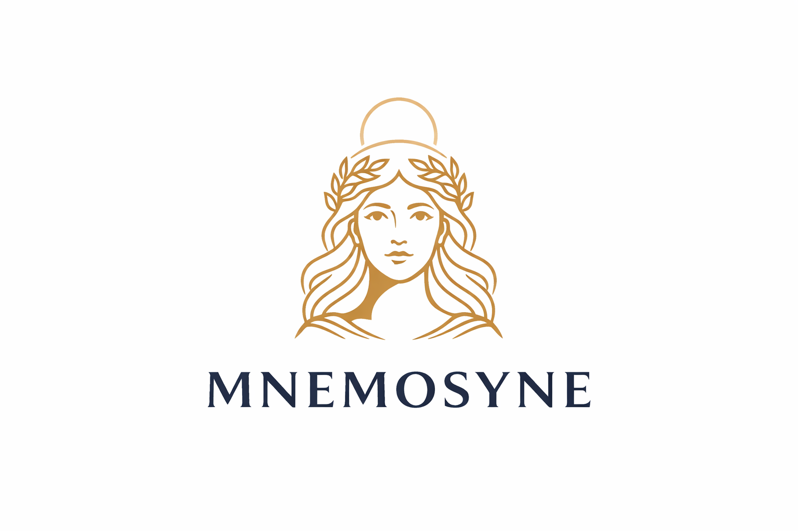
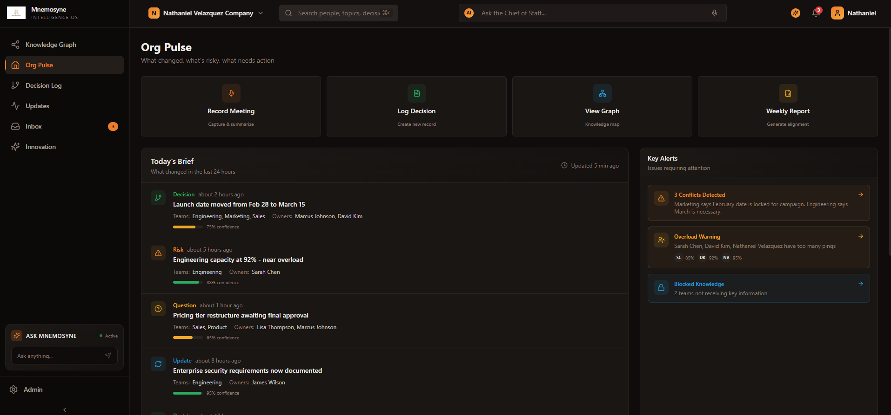
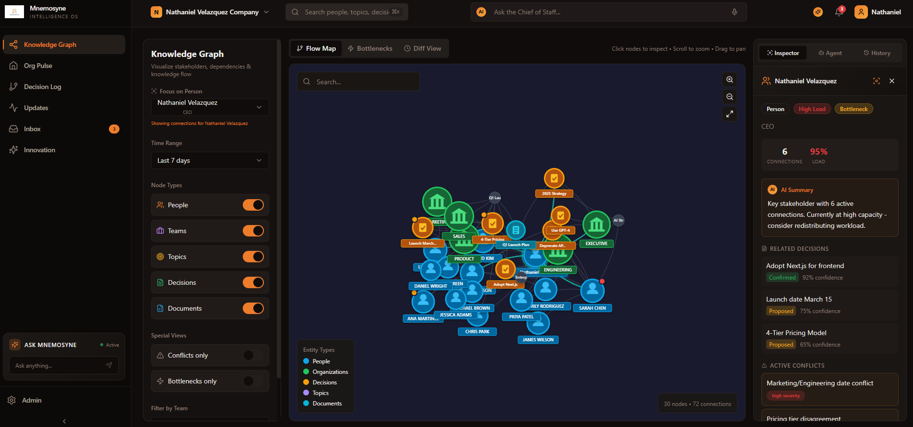
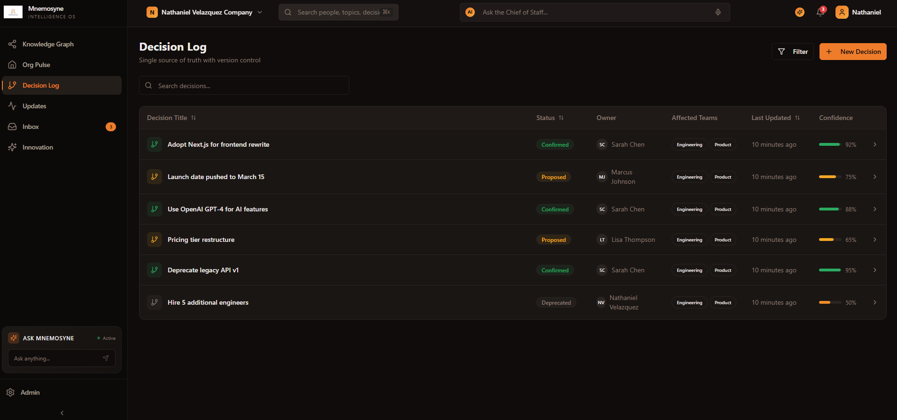
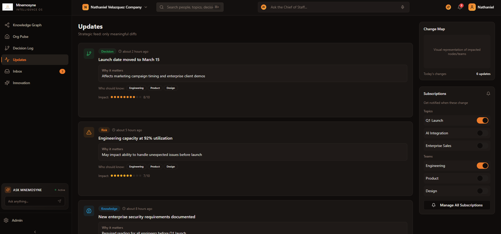
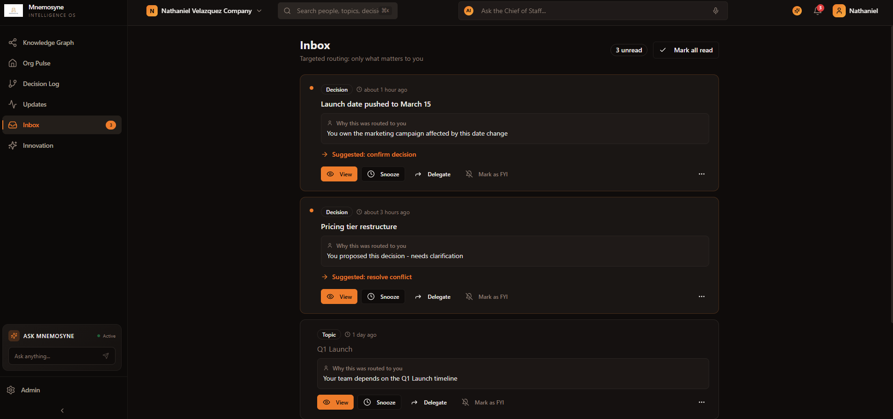

# 🧠 Mnemosyne — Organizational Intelligence OS

**Mnemosyne** is an **AI-powered Organizational Intelligence Operating System** designed to become the *memory, filter, and coordination layer* of a company.

It is not a chatbot.  
It is not a productivity tool.  

Mnemosyne acts as a **Superhuman AI Chief of Staff**, helping organizations think, decide, and align with clarity.

---

## 🌍 The Problem

Modern organizations generate massive amounts of information across:

- Meetings  
- Chats  
- Emails  
- Documents  
- Voice notes  
- Dashboards  

Yet they lack:
- A single source of truth  
- Visibility into how knowledge flows  
- Awareness of who knows what (and who doesn’t)  
- Protection against overload and contradictions  

As a result:
- Decisions become fragmented  
- Knowledge is duplicated or lost  
- People are overwhelmed or excluded  
- Alignment slows execution  

---

## 🎯 The Vision

Mnemosyne creates **organizational intelligence** by:

- Mapping how information flows across teams  
- Maintaining a living, versioned source of truth  
- Routing information only to the people who need it  
- Detecting conflicts, risks, and second-order effects  
- Preserving organizational memory over time  

The goal is **better communication, not more communication**.

---

## 🧩 Core Concepts

### 1. Organizational Knowledge Graph

A continuously updated graph that connects:
- People  
- Teams  
- Topics  
- Decisions  
- Ideas  
- Dependencies  

This graph reveals:
- Ownership and accountability  
- Information bottlenecks  
- Knowledge duplication  
- Areas of misalignment  

---

### 2. Living Source of Truth

All decisions and ideas are:
- Structured  
- Versioned  
- Traceable  
- Contextualized  

Every change answers:
- What changed?  
- Why did it change?  
- Who is affected?  
- What was the previous truth?  

---

### 3. Agentic AI Architecture

Mnemosyne operates through cooperating AI agents:

- **Memory Agent** → preserves organizational history  
- **Coordinator Agent** → routes information intelligently  
- **Critic Agent** → detects conflicts and contradictions  
- **Summarizer Agent** → transforms raw input into structured knowledge  

This enables the system to reason, not just respond.

---

## 🖥️ Platform Screens

### 🟠 Org Pulse

**Purpose:** Executive-level awareness at a glance.

Shows:
- What changed recently  
- Active risks or conflicts  
- Items requiring validation  
- Organizational load signals  

Designed for leadership clarity, not micromanagement.

---

### 🔗 Knowledge Graph

**Purpose:** Visualize how understanding spreads.

Features:
- Interactive graph of people, teams, decisions, and topics  
- Flow maps showing communication intensity  
- Bottleneck and conflict views  
- Contextual node inspection with AI explanations  

---

### 📜 Decision Log

**Purpose:** Single source of truth for decisions.

Includes:
- Canonical decision statements  
- Version history  
- Change rationale  
- Stakeholder impact  
- Routing history  

Decisions are treated like **version-controlled knowledge**, not messages.

---

### 🔄 Updates

**Purpose:** Track meaningful changes, not noise.

Only shows:
- Strategic updates  
- High-impact changes  
- AI-generated “why this matters”  
- Who should know (and why)  

This replaces traditional activity feeds.

---

### 📥 Inbox

**Purpose:** Prove targeted communication.

Each item includes:
- Why it was routed to you  
- Suggested action (Act / FYI / Watch)  
- Ability to delegate or snooze  

No broadcast spam. No blind CCs.

---

### 💡 Innovation Sprints

**Purpose:** System-aware idea development.

Each sprint includes:
- Status (Draft / Active / In Review / Completed)  
- Progress tracking  
- Votes and participation  
- Connected nodes in the knowledge graph  
- Second-order effects, such as:
  - Operational risks  
  - Compliance implications  
  - Resource conflicts  
  - Market timing impacts  

Ideas are evaluated as **systems**, not isolated proposals.

---

## 🤖 AI Interaction Model

Users interact via **Ask Mnemosyne**:
- Text or voice input  
- Context-aware answers  
- Transparent reasoning  
- Actionable suggestions  

Mnemosyne can:
- Create or revise decisions  
- Log updates  
- Flag conflicts  
- Recommend stakeholders  
- Surface second-order effects  

---

## 🏗️ Technical Architecture (High Level)

- **Frontend:** Component-based UI (Lovable-ready)  
- **Backend:** API-driven (Node / FastAPI compatible)  
- **AI Layer:** OpenAI Responses API with tool calling  
- **Database:**
  - Postgres + pgvector (semantic retrieval)  
  - Optional Neo4j for advanced graph queries  

---

## 🧠 Design Principles

- Intelligence over features  
- Visualization over text walls  
- Transparency over black-box AI  
- Alignment over velocity  
- Systems thinking over local optimization  

---

## 👤 Company Context

- **Company:** Nathaniel Velazquez Company  
- **CEO:** Nathaniel Velazquez  
- **Mode:** Executive-aware by default (CEO Digest enabled)  

---

## 🚀 Why Mnemosyne Matters

When organizations gain visibility into:
- How knowledge moves  
- Where decisions change  
- Why misalignment occurs  

They unlock:
- Faster execution  
- Higher trust  
- Better decisions  
- Collective intelligence  

Mnemosyne is not a tool.  
It is a **company brain**.

